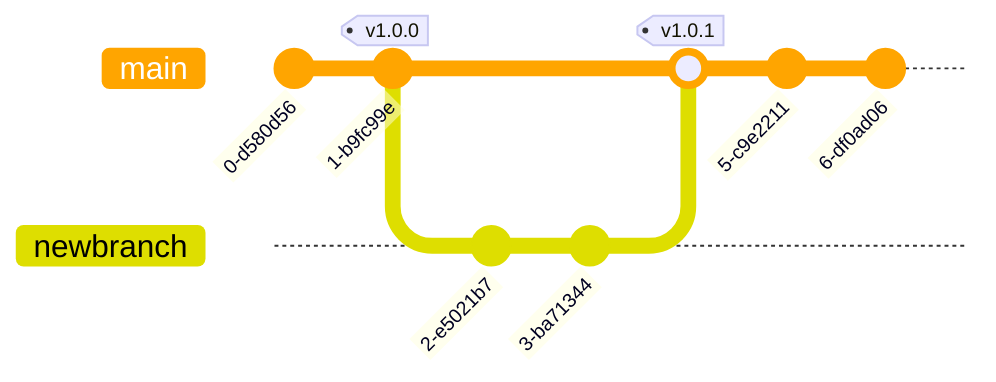

In this tutorial you'll learn how to create and maintain a version control system for your project. This tutorial assumes that you already have a project in your local machine.

# Initial Setup

### Overview

1. Create ssh keys in local machine
2. Add public ssh key to GitHub
3. Create GitHub repository
4. Connect local project to GitHub repository
5. Update your repository when code changes 


### 1. Create ssh keys in your local machine
***Skip this step if you already have ssh keys in your local machine***

Generate the ssh keys: `$ ssh-keygen`

By default it will generate the file `~/.ssh/id_ed25519`, but you can edit the name. Leave it like that.

You will be asked to enter a passphrase. This is optional. If you decide to setup a passphrase, you will need to enter the passphrase everytime you ssh to a remote server. Fortunately, you can prevent from entering the passphrase everytime by adding the private key to the ssh-agent. In order to add the private key to the ssh-agent, issue:

```
$ eval $(ssh-agent)
$ ssh-add ~/.ssh/id_ed25519
```

The files `id_ed25519` and `id_ed25519.pub` have been created in the `.ssh` directory. Copy the content of `id_ed25519.pub` to the clipboard for the next step:

```bash
$ xclip -sel c ~/.ssh/id_ed25519.pub
```

### 2. Add your public ssh key to GitHub

1. Log into GitHub ➡️  Settings ➡️  SSH and GPG keys ➡️  New SSH key
2. Paste the content of your public SSH key into the '**Key**' field. Add a descriptive label for the '**Title**' field.

### 3. Create a GitHub repository to host your project
1. Log into GitHub and click on the '**New**' button 
2. Type in the repository name
3. Add a description
4. No need to add a `README` file or `.gitignore` file. It's better to create in the local machine.
5. Click on '**Create repository**' button
6. Click on the '**Code**' button and choose the 'Local' tab and 'SSH' tab
7. Copy the URL of the repository to the clipboard for the next step by clicking on the 'copy' icon

### 4. Connect your local project to your GitHub repository
1. In your local machine, navigate to your project root directory
2. Create a `.gitignore` file of your liking
3. Then, issue these commands:
```bash
git init
git add .
git commit -m 'first commit'
git branch -M main
git remote add origin [repository URL] 
git push -u origin main
```

### 5. Update your repository when code changes in local project 
When working on your project, you can update the GitHub repository. Issue these commands:

```bash
git add .
git commit -m 'some changes'
git push
```

# Operations

### Git add
- `git add [file]`: Add a modified or untracked file from the working directory to the staging area.
- `git add -u`: Add all modified files from the working directory to the staging area.
- `git add .` Add all modified and untracked files from the working directory to the stagin area.

### Git commit
- `git commit -m 'useful comment'`
- Get the files in the staging area ready to be pushed to the remote repository

### Git push
- `git push`
- Upload all commited files to the remote repository

### Git clone

- `git clone`
- Download a whole repository from GitHub
- Used when a new developer is going to work in the project

### Git pull

- `git pull`
- It is the same as `git fetch` + `git merge`
- Updates a local repository to the latest changes from GitHub
- It is recommended to pull frequenctly when working within a team

### Git branch, git checkout & git merge

- Diverge from the main branch to develop new features without messing the main branch.
- Once the new features are tested, the diverged branch is merged with the main branch.

Workflow:

```
$ git branch newbranch
$ git checkout newbranch
[edit/create/delete files]
$ git add
$ git commit
$ git push -u origin newbranch
[edit, add, commit]
$ git push
[edit, add, commit and push as needed until the new feature is completed and tested]
$ git checkout main
$ git pull origin main
$ git merge newbranch
$ git push origin main
```



## Operations (General)

#### Setup & Config

```
git config --global/--local user.name "Your Name"
git config --global/--local user.email "your@email.com"
git config --list
```

#### Starting a Repo

```
git init                            # Option 1. Start new local repo
git clone <url>                     # Option 2. Clone repo from GitHub/Gitlab/etc
gir clone --branch <branch> <url>   # Option 3. Clone repo and checkout to branch
```

## Status and Version Control
- Check status of files in working directory: `git status`
	- **Untracked files**: New created files, not staged
	- **Modified files**: Edited files,not staged
	- **Staged**: Modified files to be commited
	- **Commited**: Modified files to be pushed
- Remove last edits in a file from working directory: `git checkout [file]`
- Undo all files editing: `git reset --hard` (like you never made any change since last commit)
- See what changes has been made: `git diff` (you can specify a filename also)
- Compare status of working directory to remote repository:
    ```bash
    git fetch origin
    git status
    ```
	- If your branch is behind compared to remote repository:
        - See what changed (raw output)
            ```bash
            git diff origin/main
            ```
		- See what changed (commit messages)
			```bash
			git log HEAD..origin/main --oneline
			```
			Example output:
			```
			a1b2c3d Add new feature X
			e4f5g6h Fix typo in README
			```
		- See actual code differences per specific commit:
			```bash
			git show a1b2c3d
			```
- Update working directory from remote repository
    ```bash
    git pull
    ```

#### Staged (after git add)
- See what has been staged: `git diff --cached` (you can specify a filename also)
- See differences between working directory and local repository: `git diff HEAD`
- Put file back to the working directory: `git reset HEAD [file]`
- Undo recent stage and all files editing: `git reset --hard` (like you never made any change since last commit)

#### Commited (after git commit)
- See what has been commited: `git diff --cached --stat origin/main`
- See differences between local repository and remote repository: `git diff main origin/main` 
- Put all files back to the staging area: `git reset --soft HEAD~1`
- Undo recent commit, stage and all files editing: `git reset --hard HEAD^` (like you never made any change since last commit)
- Edit or add new file to last commit: `git commit --amend`
- See commits historical: `git log`
- See modified files in each commit: `git log --stat`
- See changes in a particular commit: `git show [commit]`


# GitLab & Bitbucket

You can also host your code in GitLab and Bitbucket at the same time you host your code on Github.

Simply add the new repositories:

```
$ git remote add gitlab <GitLab repository URL>
$ git remote add bitbucket <Bitbucket repository URL>
```

Confirm that the repositories have been added successfully:
```
$ git remote -v
```

If you already had a GitHub repository, you can rename it for consistency:
```
$ git remote rename origin github
```

To push the changes in your code for all repositories:
```
$ git push github main
$ git push gitlab main
$ git push bitbucket main
```

If we create and checkout to a new branch, the first push with the new branch is like this:
```
git push -u github newbranch
git push -u gitlab newbranch
git push -u bitbucket newbranch
```

Next pushes are like this:
```
git push github newbranch
git push gitlab newbranch
git push bitbucket newbranch
```

